# GitHub MERN Stack Repository Connector

In the Harness CI module user interface, click *New Connector*.

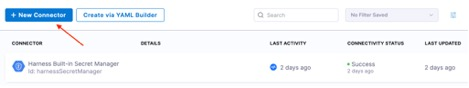

Select *GitHub*

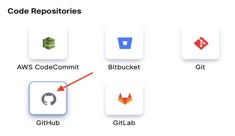

Enter “MERN Stack Example” in the Name field, then click Continue.

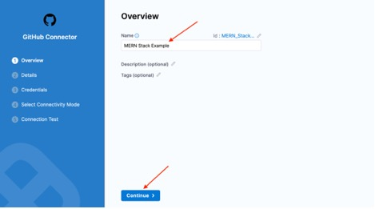

Select **Repository** for **URL Type**.

Select **HTTP** for **Connection Type.**

Enter the url of your MERN Stack Example repoin the **GitHub Repository URL** field. Then click **Continue**.

 

Enter your GitHub username in the **Username** field, then click **Create or Select a Secret**.

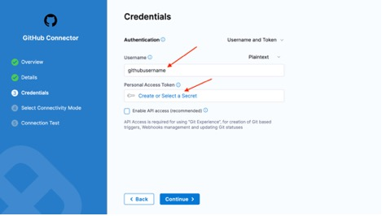

Select **GitHub Personal Access Token**, then click **Apply Selected**.

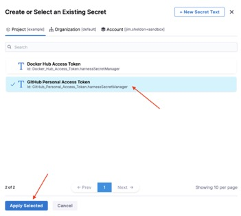

Verify that **GitHub Personal Access Token** appears in the **Personal Access Token** field. Then click Continue.
 

Select **Connect through a Harness Delegate**, then click Continue.

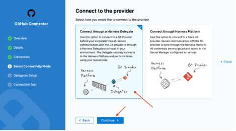

Select **Only use Delegates with all of the following tags**. Then select **mern-demo** from the drop-down menu.

Click **Save and Continue**.
 
 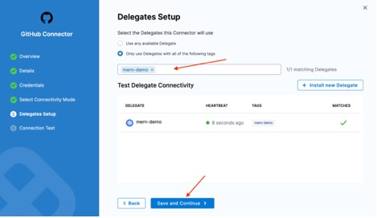

A connection test will run, when you see Verification successful, click Finish.

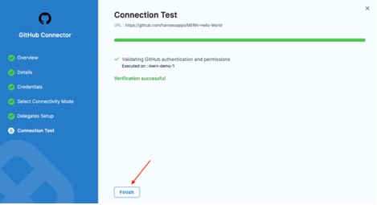
 
# GitHub MERN Stack Example GitOps Repository

Click New Connector.
 

Select *GitHub*

Enter “MERN Stack Example GitOps” in the **Name** field, then click **Continue**.

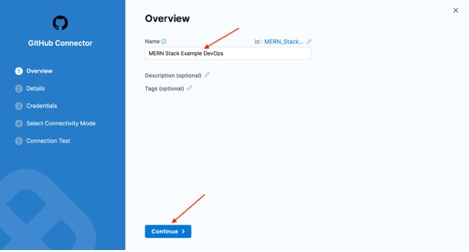

Select **Repository** for **URL Type**.

Select **HTTP** for **Connection Type**.

Enter the url for your GitOps clone in the **GitHub Repository URL** field. Then click **Continue**.

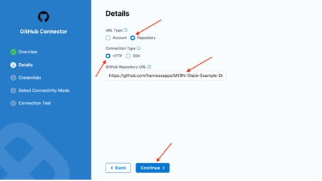

Enter your GitHub username in the **Username** field, then click **Create or Select a Secret**.
 

Select **GitHub Personal Access Token**, then click **Apply Selected**.

Verify that **GitHub Personal Access Token** appears in the **Personal Access Token** field. Then click **Continue**.

Select Connect through a Harness Delegate, then click Continue.
 

Select **Only use Delegates with all of the following tags**. Then select **mern-demo** from the drop-down menu.

Click Save and Continue.

A connection test will run, when you see Verification successful, click Finish.
 

# Kubernetes Cluster

Click **New Connector**.
 

Select **Kubernetes Cluster**.
 
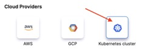

Enter “My Cluster” in the Name field, then click **Continue**.
 
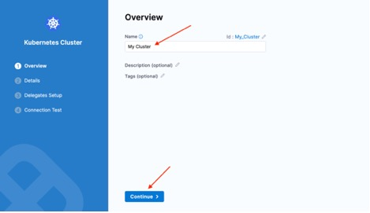

Select **Use the credentials of a specific Harness Delegate**, then click **Continue**.
 
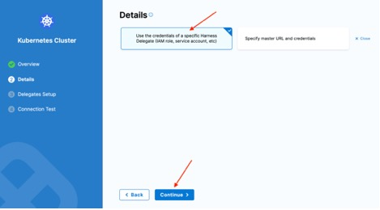

Select **Only use Delegates with all of the following tags**. Then select **mern-demo** from the drop-down menu.

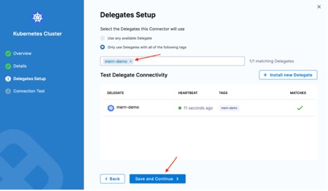

Click **Save and Continue**.
 
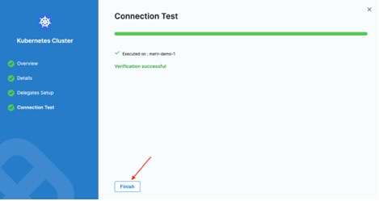

Wait for the test to complete, then click **Finish**.

# All done with Connectors!

<a class="btn btn-primary" href="../Connectors/connectorDetails">Can I go back to the connectors intro please?</a>
<a class="btn btn-primary" href="../Services/servicesIntroduction">✅ Onward and Upwards to Services</a>