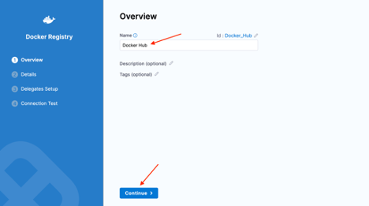
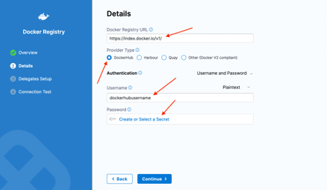
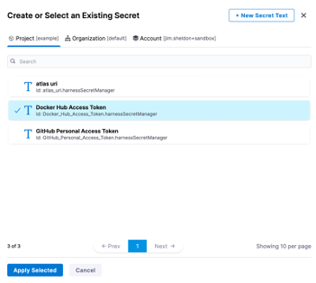
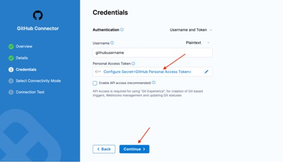
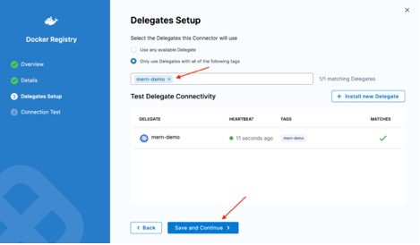
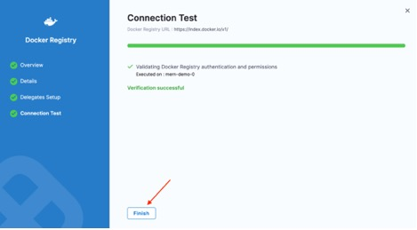

Yep, Connectors… connect to things. I swear we don’t pay our naming team enough. In this case we use connectors to link to Docker Hub, GitHub, and your Kubernetes cluster. You may be thinking, Wait! We just created a secret for these… And you’re right. Connectors use secrets, which is why we had you set those up first. Like we did for secrets, let’s walk through the first one, because it has a bit of a twist. After that you’ll have the opportunity to fly like a bird, or walk with me through the rest! Ready? Here we go!  

## Docker Hub

Click New Connector.

Enter “Docker Hub” in the Name field, then click Continue.

Enter “https://index.docker.io/v1/” in the Docker Registry URL field. That ‘/v1/’ bit is the tricky part. Tripped me up the first time I worked through this, and I’m (dramatic superhero voice) Captain Canary!

Select Docker Hub for the Provider Type.

Enter your Docker Hub username in the Username field, then click Create or Select a Secret.

Select Docker Hub Access Token, then click Apply Selected.

Verify that Docker Hub Access Token appears in the Password field. Then click Continue.

Select Only use Delegates with all of the following tags. Select mern-demo from the drop-down menu. Selecting a specific delegate can be useful in select circumstances. Like when you have many delegates or many clusters. This is how you ensure your CI work is happening in the correct cluster..

Click Save and Continue.

Wait for the test to complete, then click Finish.

# woot!
At this point, we’ve created the Docker Hub connector. W00t! Feeling good about how to create those connectors? If so, go ahead and switch over to your Harness CI tab, and create connectors for:
- GitHub - a connector to your clone of our MERN Stack Example App. This is the actual application you’ll configure Harness to build!
- GitHub - a connector to your clone of our MERN Stack Dev Ops repo. You won’t need this right now, but soon enough, so go ahead and set up this connector now. This repo has all the manifests needed to deploy the application to your cluster. Note how we keep it in a separate repo! GitOps for the win!
- Last, but certainly not least, you’ll need to set up a connector for your Kubernetes cluster!

Want some additional guidance?  
<a class="btn btn-primary" href="../Connectors/connectorDetails">No problem, take this red pill and we’ll deep-dive into the matrix.</a>
<a class="btn btn-primary" href="../Services/servicesIntroduction">✅ I DID IT! I created my connectors! Take me to the Services</a>