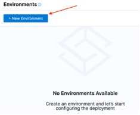

## Environment
Hi, me again, your favorite neighborhood Captain Canary. I know this feels like a ton-of-setup. Not gonna lie, it is. That’s the bad news. I’ve three bits of good news for you:
1.	I’ve been squawking at people to try and make this better, faster, stronger. They’re listening, and you can now do cool things like setup a connector and define the secret right there!!! 
2.	I promise, you only have to do this once-per-project. 
3.	We’re at the (queue Europe’s The Final Countdown) final setup stage! (Streamers fall!)
Since Environments only have a name and a type selection, let’s just all do this together.

Click **New Environment**.

Enter “demo” in the **Name** field.

Select **Pre Production** for **Environment Type**, then click **Save**.

## And that's it. 

<a class="btn btn-primary" href="../Services/servicesDetails">Wait! What's a service again?</a>
<a class="btn btn-primary" href="../Pipelines/pipelinesIntroduction">✅ All done with Environments! Let me at those pipelines</a>

