## MERN Client CI Pipeline

Click **New Pipeline**.

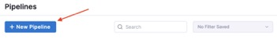

Enter “Build MERN Client” in the **Name** field, then click **Start**.

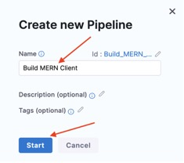

### Stage

Click **Add Stage**, then select **Build**.


Enter “MERN Client” in the **Stage Name** field, then click **Select Connector**.

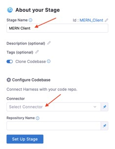

Select **MERN Stack Example**, then click **Apply Selected**.


Verify that MERN Stack Example appears in the Connector field, then click Set Up Stage.

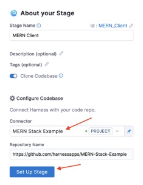

Verify that MERN Client appears in the Name field, then click Continue.

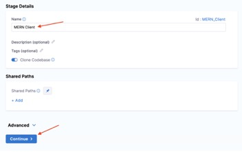

select **Hosted by Harness** and then click **start provisioning**.


And you’re done with the delegate.

### Build Step

Click **Add step**.


Select **Build and Push an image to Docker Registry**.

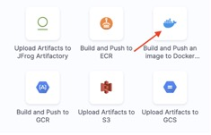

Enter “Client Docker Image” in the **Name** field.

Click **Select** in the **Docker Connector** field.

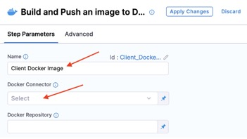

Select **Docker Hub**, then click **Apply Selected**.

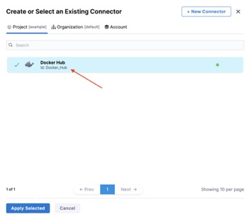

Verify that **Docker Hub** appears in the **Docker Connector** field.

Enter “dockerusername/mern-client” in the **Docker Repository** field. Replacing “dockerusername” with your Docker Hub username. Then click **Add**.

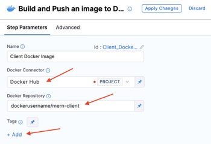

Enter ```<+pipeline.sequenceId>``` in the **Tag** field, then click **Optional Configuration**.

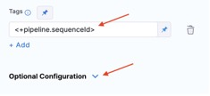

Enter “client/Dockerfile” in the **Dockerfile** field.

Enter “client” in the **Context** field, then click **Add** under **Build Arguments**.

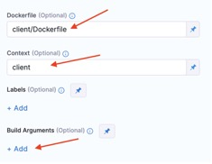

Enter “SERVER_URI” in the first field. Then select Runtime input from the drop-down menu in the second field.

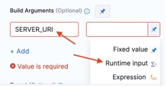

Verify the **SERVER_URI** build argument value shows **<+input>**.

Enter “2000Mi” in the **Limit Memory** field.

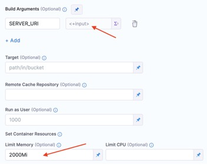

Click **Apply Changes**.

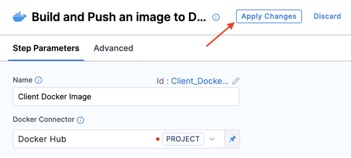


### Run Pipeline

Click **Save**.

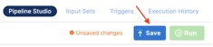

Click Run.

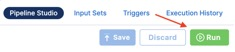

Select **Git Branch** for **Build Type**.

Enter “main” in the Branch Name field.

Enter your MERN Server’s URI in the **SERVER_URI** value field. This will be the external IP of the server retrieved with kubectl in the previous step. In this example, the MERN Server’s URI is `http://34.75.52.141:5001`, replace `34.75.52.141` with your MERN Server’s external IP.

Click Run Pipeline.

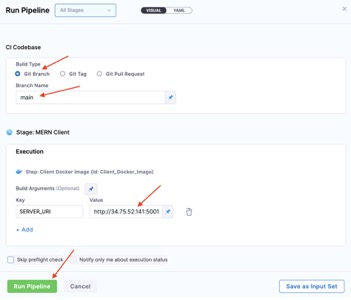

Now that you’ve built the images, tested them and pushed them to Docker Hub, you are ready to deploy into production. That’s where continuous delivery comes in. To continue your journey, check out the second part of this series, Harness CD for MERN Stack Example.