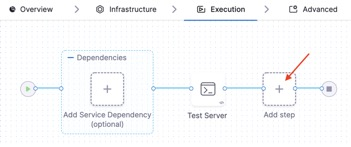
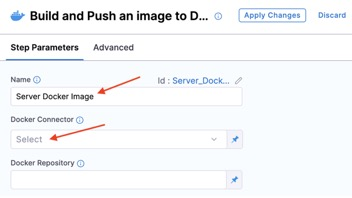
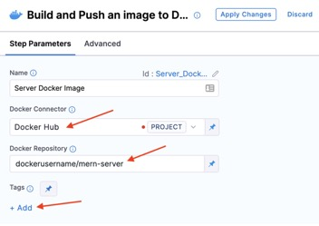
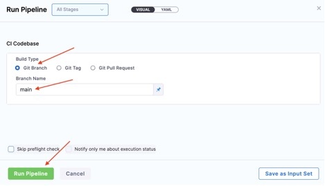
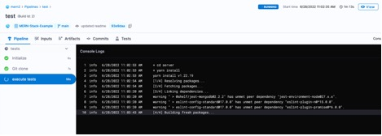

Having issues with it? That’s cool. I probably missed something in this walk through. Let’s walk through adding the build step together, shall we? 
Build Step

Click **Add step**.
 

Select **Build and Push an image to Docker Registry**.
 

Enter “Server Docker Image” in the **Name** field.

Click **Select** in the **Docker Connector** field.
 

Select **Docker Hub**, then click **Apply Selected**.
 

Verify that Docker Hub appears in the Docker Connector field.

Enter “dockerusername/mern-server” in the Docker Repository field. Replacing “dockerusername” with your Docker Hub username. Then under Tags, click Add.
 

Enter “<+pipeline.sequenceId>” in the Tag field. Then click Optional Configuration. If you're wondering what that bit of text means and does, never fear. What we're doing here is telling Harness CI to tag the Docker image with the build number. Since that's sequential, we'll always know how to order them.
 

Enter “server/Dockerfile” in the **Dockerfile** field.

Enter “server” in the **Context** field.
 

Click **Apply Changes**.
 

### Run Pipeline

Click **Save**.
 

Click **Run**.
 

Select **Git Branch **for **Build Type**.

Enter “main” in the Br**anch Name** field, then click** Run Pipeline**.
 

And just like that, your build is running. How fly is that? But we’re not done yet. As a developer, you’ll want to see the logs, and understand what they tell you. As your build runs you should see this:
 

I took this screenshot while the build was running, but there’s two things I want to show you. First, on the left you’ll see the actions taken. In our case, there’s the initialization and Git clone. Harness CI does these actions for you. The third one is our test action. And the logs you see on the left show the output of your step. In our case, you can see it executing yarn install. 

The pipeline we’ve built also publishes our docker image to Dockerhub. I’ll leave it as an exercise for the reader to verify the image made it safely to dockerhub. Just remember, there can be a small delay between pushing your image, and it showing up on https://hub.docker.com. 

And just like that, you’ve built your first CI pipeline. Now unless my minions (*ahem*.** Forgive them, they are but eggs.**) have broken the example application, your build **should succeed**. 
 
When we started this journey we talked about how this application had three layers. A frontend, backend and database layer. We’ve just built a pipeline to test and build the backend, or server layer. We, er, I mean you, need to build the pipeline for the frontend. Pilot, you are clear for takeoff.

<a class="btn btn-primary" href="../Pipelines/pipelinesIntroduction">I'd like to restart the pipelines section please</a>
<a class="btn btn-primary" href="../Pipelines/clientIntroduction">✅ All done with the server pipeline! Lets tackle the client pipeline</a>
