## MERN server CI Pipeline
Oh hai! Captain Canary again. We’ve done our pre-flight checklist, and gotten all our resources squared away. It’s time to get to the fun part of a CI system - the Pipeline. When we say Pipeline (you say YAY). In all seriousness, Pipelines are the beating heart of Harness CI. Now this MERN stack example is about as basic as they come, but there are still two steps involved. Our pipeline defines what those steps are, and what order they execute in. As usual, we’re going to walk through the creation of the Pipeline, and its first step. We’ll have instructions for the second step, if you’d like them.

Open Harness CI and click **Create a Pipeline**

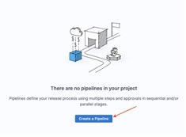

Enter “Build MERN Server” in the Name field, then click Start.

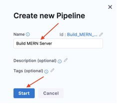

### Stage

Click **Add Stage**, then select **Build**.
 
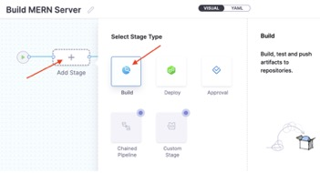

Enter “MERN Server” in the **Step Name** field, then click **Select Connector**.
 
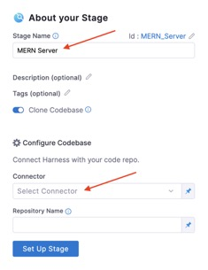

Select **MERN Stack Example**, then click **Apply Selected**.
 
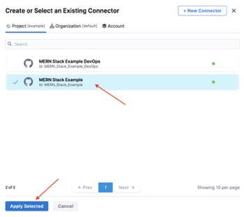

Verify that **MERN Stack Example** appears in the **Connector** field, then click **Set Up Stage**.
 
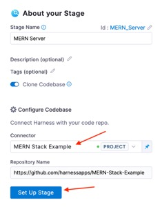

Verify that MERN Server appears in the Name field, then click Continue.
 
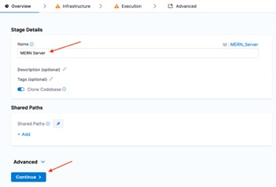

### Delegates
Harness helps you run your CI workloads across a fabric of compute environments. To facilitate this, Harness uses a ‘Delegate’. Our delegate serves two purposes. First, to provide a secure communication link between Harness and your compute environment. Secondly, to allow Harness to delegate CI tasks to your compute environment. Yeah, it’s why we named it the delegate. #NamingThingsIsHard

In order to use Harness CI, you’ll need a delegate. And you may be thinking - wait! I don’t have an environment yet! Normally you’d be right, but our engineering team used some deep magic, and you can use a *Harness Hosted Delegate*! Magic! As you might imagine, given our crack naming team, a Harness Hosted Delegate is, well, hosted by Harness. In fact, it’s just a single button click to set it up. Let’s do that!

On your infrastructure tab, you’ll see this: 
 
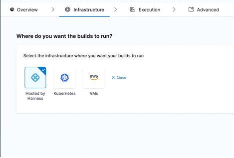

For now, select *Hosted by Harness* and then click start provisioning.
 
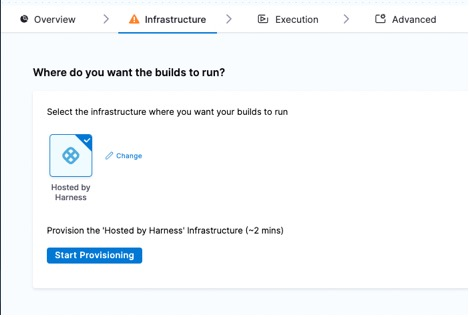

And you’re done with the delegate.

### Test Step

Click **Add step**.
 
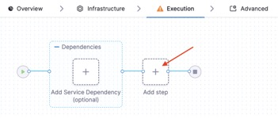

Select the **Run** step.
 
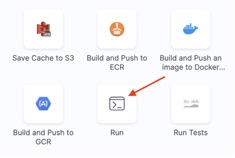

Enter “Test Server” in the **Name** field, then click **Select** in the **Container Registry** field.
 


Select **Docker Hub**, then click **Apply Selected**.
 
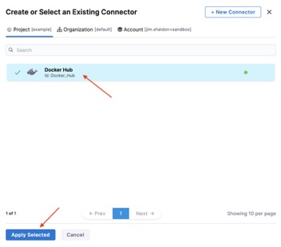

Verify that **Docker Hub** appears in the **Container Registry** field.
Enter “node:16” in the **Image** field.

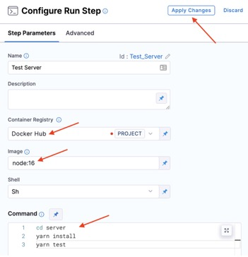


Enter these lines in the **Command** field:

```
cd server
yarn install
yarn test
```

Then click **Apply Changes**.


Ok, that’s sorted. You’ve created a pipeline with a single step. Now depending on your needs, that may be the only step you have in the pipeline. Want to run Unit tests on every commit? That pipeline is only going to have this testing step. But for this MERN Stack example, let’s take it a step further. Here’s where I boldly push you from the nest. I want you to set up a second step in this pipeline that will build a docker image and push it to Docker Hub. Why? Well this is what CI is all about, right? CI tests, merges and builds our software artifacts. 

To build out this step, you’ll use the Docker Hub connector, and the secret you created earlier.

Hint: Harness has a built-in action to build and push docker images to Docker Hub. Now go on, get on it!

## And that's it. 

<a class="btn btn-primary" href="../Pipelines/pipelinesDetails">Wait! I was walking my pet butterfly and missed something about pipelines. Help?</a>
<a class="btn btn-primary" href="../Pipelines/clientIntroduction">✅ All done with the server pipeline! Lets tackle the client pipeline</a>


