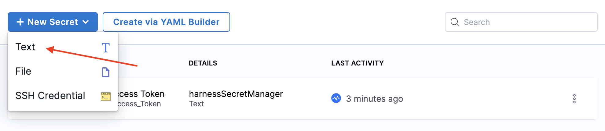
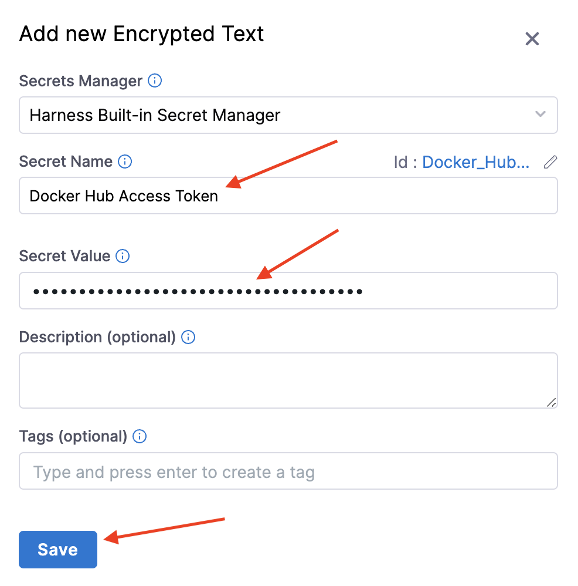
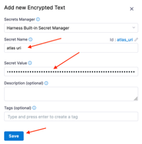

Not feeling confident with adding secrets? No big deal. Can I tell you a secret? I had my friend Jim walk me through setting up Harness secrets. Twice.

## Docker Hub Access Token

Harness needs a Docker Hub access token to publish Docker images to your account. See Docker Hub’s [Manage access tokens documentation](https://docs.docker.com/docker-hub/access-tokens/) to learn how to create an access token. The token must have **Read**, **Write** and **Delete** permissions.

To get started, click New Secret, then select Text.

Enter “Docker Hub Access Token” in the Secret Name field.

Enter your access token in the Secret Value field, then click Save.

## MongoDB Atlas URI

The server process needs access to a MongoDB instance. [You can create a free “shared” MongoDB Atlas instance by clicking here](https://www.mongodb.com/free-cloud-database).

Ensure that the MongoDB Atlas instance is accessible from your Kubernetes cluster.

Click New Secret, then select Text.

Enter “atlasMongoDB Atlas uri” in the Secret Name field.

Enter your MongoDB Atlas URI in the Secret Value field, then click Save.

<a class="btn btn-primary" href="../Secrets/secretsIntro">🔙 Wait, what's a secret again?</a>
<a class="btn btn-primary" href="../Connectors/connectorsIntro">✅ Done! All my secrets are belong to you. Take me to the next step!</a>