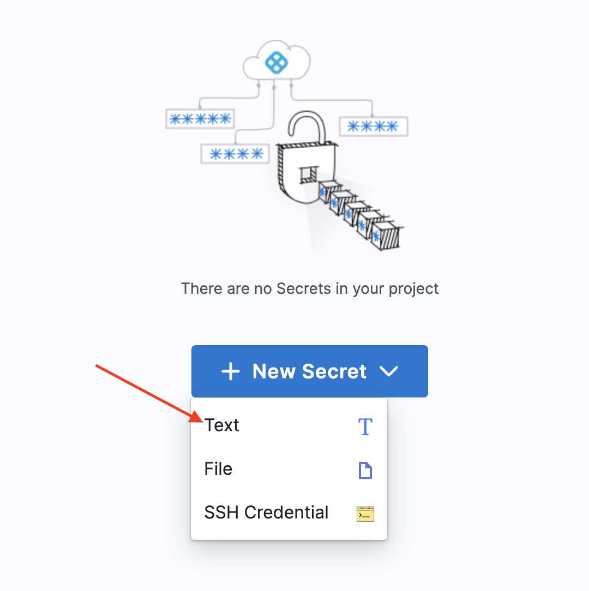

Greetings! Captain Canary, again. One time, in third grade, I had a huge crush 💞 on Dolores 🦢. Honestly, as far as secrets go that’s not a great one; but you get the idea. Harness uses secrets to securely store things like access tokens. 

We’re going to walk you through creating the GitHub secret. Then you’ll have a choose-your-own-adventure path for the remaining secrets. You know, the ones for Docker Hub and MongoDB Atlas URI.

## GitHub Personal Access Token
Harness needs a Personal Access Token to access GitHub repositories. Refer to the Add a GitHub Connector documentation for how to generate the token.

1. `Click New Secret, then select Text.`
   
2. `Enter “GitHub Personal Access Token” in the Secret Name field.`
3. `Enter your Personal Access Token in the Secret Value field, then click Save.`
4. 

Easy peasy lemon 🍋 squeezy! Right? Ok, now if you’re feeling like you’ve got this, feel free to jump over to Harness and add two more secrets:
A text secret called ‘`Docker Hub Access Token`’ (Again, our crack team of naming specialists is top notch!) populated with your Docker Hub access token.
A text secret called ‘`MongoDB Atlas URI`’. You'll need to populate it with the connection url from the MongoDB Atlas console.

<a class="btn btn-primary" href="../Namespaces/creatingTheNamespace">🔙 Let me see the previous page again</a>
<a class="btn btn-primary" href="../Secrets/secretsDetails">You know what, I'd like to follow the bouncing ball 🏀 </a>
<a class="btn btn-primary" href="../Connectors/connectorsIntro">✅ Done! All my secrets are belong to you. Take me to the next step!</a>