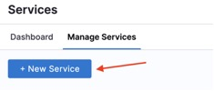
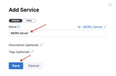
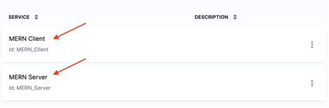

Still with me? Good. We’ll let the overconfident folk stumble through this. Let’s do this together.

### MERN Server

Open Manage Services and click New Service.
 
 

Enter “MERN Server” in the Name field, then click Save.
 

### MERN Client

Open Manage Services and click New Service.
 

 

Verify that MERN Client and MERN Server appear in the service list.

<a class="btn btn-primary" href="../Services/servicesIntroduction">Wait! What's a service again?</a>
<a class="btn btn-primary" href="../Environments/environmentIntroduction">✅ All done with Services. I created everything and take me to Environment</a>
